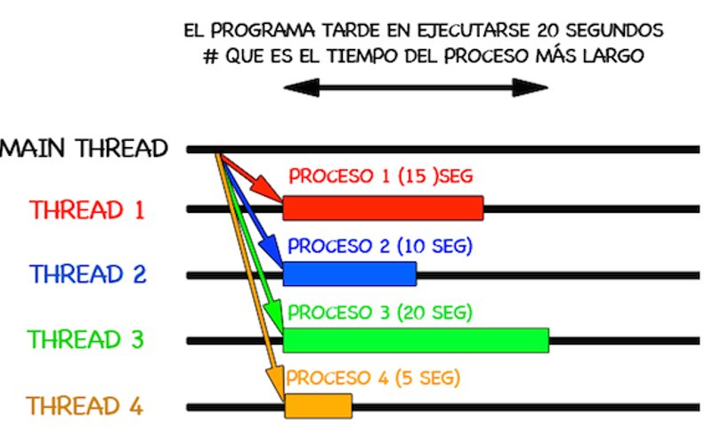
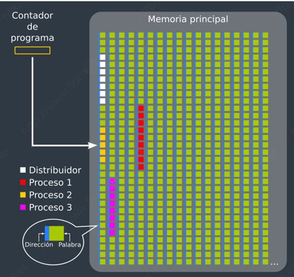
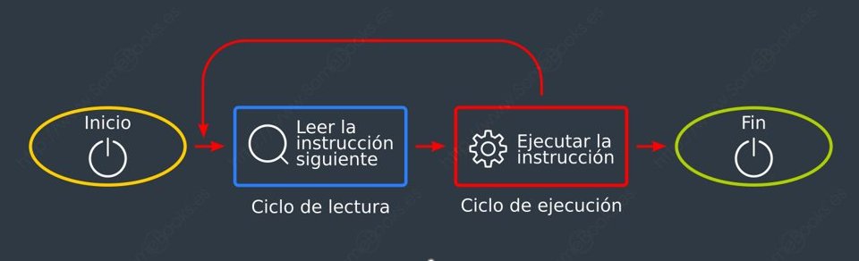
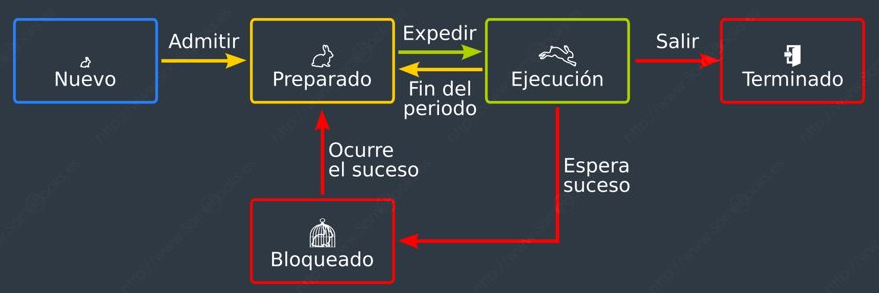

# Unidad 2. Gestión de recursos de un sistema operativo

# Componentes del sistema operativo

Recordamos que el sistema operativo es un “conjunto de programas” que se encarga de gestionar los recursos hardware y software del ordenador, por lo que actúa como una interfaz (intermediario) entre los programas de aplicación del usuario y el hardware.​

* **​Kernel o núcleo.** Es el componente esencial de un sistema operativo y de ahí su nombre, y sirve para administrar los recursos de hardware solicitados por los diferentes elementos de software, decidiendo a qué y cuándo se concede este acceso. Se ejecuta en modo privilegiado.​​
* **Gestor de procesos.** Un proceso es un programa en ejecución. Encargado de crear, finalizar, parar o reanudar procesos y de ofrecer mecanismos para que los procesos puedan comunicarse y sincronizarse, así como posibilidad de establecer prioridades.​​
* **Gestor de memoria.** Es el componente encargado de gestionar la memoria del sistema. El gestor de memoria se encarga de asignar y liberar la memoria del sistema para las aplicaciones y procesos que se están ejecutando en el momento, y garantiza que el espacio de memoria esté siendo utilizado de manera óptima.​​
* **Gestor de entrada/salida.** El Gestor de E/S es un componente se encarga de la coordinación y gestión de los dispositivos de entrada/salida en la computadora. Su función principal es proporcionar una interfaz coherente y eficiente para el acceso a los dispositivos de E/S y garantizar que los recursos del sistema se utilicen de manera efectiva.​​
* **Gestor de almacenamiento.** Dentro de la gestión del almacenamiento podemos distinguir entre gestión de archivos y gestión de almacenamiento. ​​
* **Sistemas de protección.** Es la parte del sistema operativo que abarca los mecanismos destinados a controlar el acceso de los procesos y usuarios a los recursos definidos por un sistema informático. ​​
* Gestor de comunicaciones. Se encarga de coordinar y controlar el acceso a la red, permitiendo que las aplicaciones y procesos se comuniquen con otros dispositivos en la red.​​
* **Interfaz de usuario.** Es la parte que permite al usuario interaccionar con el ordenador. Esta interfaz puede ser gráfica, proporcionando un escritorio, ventanas y componentes gráficos para una interacción más intuitiva, o bien puede ser a través de una línea de comandos.​

# Gestión de procesos

Un **proceso** es un programa en ejecución. No debemos confundir programa con proceso. Cuando un programa se ejecuta, entonces pasa a ser un proceso.​ Un programa es un objeto pasivo, es decir un archivo de datos más en un medio de almacenamiento, sin embargo, un proceso es un objeto activo, al cual el sistema operativo asignará recursos que necesita para realizar su tarea (tiempo de CPU, memoria, archivos y dispositivos de e/s.) y controlará su ejecución.​

> No confundir programa con proceso

​Cuando se crea un proceso, se le asocia un paquete de información denominado Bloque de Control de Proceso (BCP), que le acompaña durante toda su vida. En este BCP se recogen datos del proceso como son:​

* ​Su estado actual.​
* Su PID (identificador de proceso) o Process IDentifier​.
* Valores de registros asociados a él, como el contador de programa, los punteros, acumuladores, etc.​
* Valores de los recursos asignados: espacio en memoria, archivos, E/S, etc.​

Todos los procesos, desde su creación, tendrán la capacidad de comunicarse y sincronizarse con otros procesos y con recursos del sistema. Este hecho da lugar a diferentes tipos de procesos:​

* Independientes: no se comunican con otros procesos. Estos tipos de procesos apenas existen.
* Cooperativos: se comunican y sincronizan para realizar una actividad común.​
* Competitivos: necesitan hacer uso del mismo recurso y, por consiguiente, competirán por él.​

​En cualquier caso, la ejecución de los procesos exigirá concurrencia, cualidad que deberá gestionar el sistema operativo gracias a técnica denominada **multiprogramación**, que permite que dos o más procesos puedan ejecutarse simultáneamente.​

​De todos los procesos que se están ejecutando a la vez sólo uno tiene la "atención del usuario"; Este proceso se dice que está en **primer plano** y del resto se dice que están en **segundo plano**. Es posible pasar un proceso de primer plano a segundo plano y viceversa. Un demonio o daemon (Linux) o **servicio** o service (Windows) es un proceso que se ejecuta en segundo plano sin necesidad alguna de interacción con el usuario para llevar a cabo su tarea.​

## Hilos

Los hilos o hebras (del inglés thread) representan un método software para mejorar el rendimiento y eficacia de los sistemas operativos. Los hilos de un mismo proceso compartirán recursos, como memoria, archivos, recursos hardware, etc.​

​En los actuales sistemas operativos, un proceso puede tener internamente varias actividades concurrentes llamadas hilos de ejecución. Son como “miniprocesos”, unidades pequeñas en las que se divide un proceso, cada una de las cuales realiza una acción.​

​Dicho de otra forma, cada hilo de procesamiento contiene un trozo de la tarea a realizar. De esta forma la CPU es capaz de procesar varias tareas al mismo tiempo y de forma simultánea, de hecho, podrá hacer tantas tareas como hilos tenga, y normalmente dos por cada núcleo.​

​Los sistemas operativos modernos están preparados para crear más de un hilo de ejecución en un proceso. Con las tecnologías multi-core (multiprocesador) esto se hace algo necesario para poder sacar mayor provecho al recurso de procesamiento. En los procesadores que tienen, por ejemplo 6 núcleos y 12 hilos, serán capaces de dividir los procesos en 12 tareas distintas, en lugar de solamente 6.​

## Ejecución de un proceso

Los programas están desarrollados mediante un determinado lenguaje de programación.​

Un programa está compuesto por unas determinadas lineas de código, las lineas de código describen operaciones específicas u ordenes que son las secuencias de instrucciones.​

​Para que un proceso se ejecute, su secuencia de instrucciones debe encontrarse en la memoria principal. Además, en todos los sistemas operativos modernos, se va intercalando la ejecución de distintos procesos, de forma que se alternan el uso del procesador.​

​Para saber en qué posición de memoria se encuentra la siguiente instrucción que debe ejecutarse, el procesador dispone de un registro llamado Contador de programa (en inglés, Program Counter, o PC), que irá cambiando de valor según pase el tiempo.​

​La secuencia de valores que vaya teniendo el Contador de programa podrán apuntar a instrucciones de diferentes procesos.​

El procesador ejecutará el código perteneciente a un módulo del sistema operativo, llamado Distribuidor (en inglés, Dispatcher), cada vez que un proceso haya consumido su tiempo (medido en ciclos de instrucción) o haya solicitado algún servicio por el que deba esperar (p. ej. una operación de E/S).​

Podemos definir un ciclo de instrucción como el tiempo que emplea el procesador en ejecutar una instrucción en lenguaje máquina y, de un modo simplificado, podríamos dividirlo en dos pasos:​

* ​El ciclo o fase de lectura (en inglés, fetch), que consiste en cargar una instrucción desde la memoria principal a los registros del procesador.​
* El ciclo o fase de ejecución (en inglés, execute), que consiste en interpretar la instrucción (decodificarla) y ejecutarla, enviando las señales adecuadas a los componentes que deben realizar la operación que indica la instrucción.​

> Por este motivo, también suele llamarse ciclo de fetch-and-execute o fetch-decode-execute.​

## Estados de un proceso

El procesador ejecutará el código perteneciente al distribuidor cada vez que un proceso haya consumido su tiempo o haya solicitado algún servicio por el que deba esperar. Así se evita que un proceso se apropie del procesador de forma indefinida. De esta forma se definen 5 estados:​

* **Nuevo:** Momento en el que se está creando el proceso. ​
* **Preparado, en espera:** Está esperando a que se le asigne la CPU (un procesador).​
* **En ejecución:** En este estado se encontrará el proceso que ocupa la atención del procesador en ese momento. Si el ordenador dispone de varios procesadores, podrá existir un proceso en ejecución por cada uno de los núcleos presentes (o un proceso por cada hilo).​
* **Bloqueado:** Está a la espera de que suceda un evento.​
* **Terminado:** Finaliza su ejecución. Muere.​

## Planificador de procesos

Una de las claves para que un sistema multiprogramado sea eficaz es la Planificación de procesos, que consiste en ir asignando procesos al procesador (o procesadores / núcleos) a lo largo del tiempo, de forma que se cumplan los objetivos en varios aspectos:​

* **Rendimiento:** Trata de maximizar el número de acciones que se completan en un plazo de tiempo determinado.​
* **Tiempo de respuesta:** El sistema debe responder a las solicitudes de los usuarios en un tiempo adecuado.​
* **Tiempo de retorno:** El sistema debe ofrecer resultados de los procesos por lotes en un tiempo adecuado.​
* **Equidad:** Todos los procesos deben ser considerados según sus características.​
* **Eficiencia:** Se debe aspirar a que el procesador esté activo constantemente.​

​El módulo del sistema operativo que se encarga de esta tarea se denomina Planificador (en inglés, Scheduler). Según el diseño del sistema operativo, el Planificador utilizará unos criterios u otros para llevar a cabo su tarea. Estos criterios reciben el nombre de Algoritmos de Planificación (o también, Políticas de Planificación). Se puede distinguir entre​

​Políticas de planificación Apropiativa: El sistema operativo tiene la capacidad de interrumpir un proceso en ejecución y dar paso a otro proceso en cualquier momento, incluso si el proceso en ejecución no ha finalizado su ejecución​
Política de Planificación No Apropiativa. Un proceso en ejecución no se interrumpe hasta que haya completado su tiempo asignado en la CPU​

​Algunos de los algoritmos o políticas de planificación más importantes son:​

* **FCFS​**
* **SJF​**
* **RR​**
* **SRT​**
* **SRTF**

## Comunicación entre procesos
En muchas ocasiones, un sistema operativo ejecuta varios procesos que deben comunicarse entre ellos para colaborar en un objetivo común. Para lograrlo, el sistema puede ofrecer una serie de funciones llamadas IPC (del inglés, Inter-Process Communication) que facilitan el envío de mensajes entre los procesos para comunicarse y sincronizarse.

Otra forma que tienen los procesos de comunicarse entre sí es compartiendo determinadas zonas de memoria.

Cuando los procesos que necesitan comunicarse están en ordenadores diferentes, se utiliza RPC (del inglés, Remote Procedure Call). Sin embargo, quien programa dichos procesos no tendrá que preocuparse de su ubicación física y de los aspectos que deriven de esa circunstancia. Para ellos, no habrá diferencia con la comunicación con procedimientos locales. Es decir, será el sistema operativo quien se encargue de resolver los problemas que se deriven de esta situación.

## Bloqueos

 En los sistemas operativos de tiempo compartido, se pueden presentar problemas a la hora de competir por los recursos del sistema. El sistema operativo debe ofrecer mecanismos para sincronizar la ejecución de los procesos.

En la siguiente imagen vemos un proceso que se encuentra actualmente en ejecución (verde), otro que se encuentra bloqueado (amarillo) en espera de poder utilizar la impresora y un tercero (rojo) que se encuentra suspendido (no está usando la memoria principal, aunque la tiene solicitada)

Es importante que el sistema operativo trate de evitar el interbloqueo o bloqueo mutuo (en inglés, deadlock), que consiste en que dos procesos diferentes necesitan los dos mismos recursos y cada uno de ellos tiene uno asignado. Ambos estarán bloqueados en espera de que se libere el recurso que aún no tienen y, por lo tanto, ninguno liberará el recurso que ya poseen.

# Gestión de Memoria

La memoria es un elemento clave del sistema operativo a la hora de ejecutar un proceso, ya que para que un proceso se ejecute es necesario que esté cargado en la memoria principal. La memoria principal es un recurso finito, por tanto el sistema operativo tiene que gestionarla eficientemente, la parte del sistema operativo destinado a administrar la memoria es el **gestor de memoria.**

El gestor o administrador de memoria se encarga de:
* Asignar memoria a los procesos y liberarla cuando han finalizado.
* Intercambio de datos entre la memoria y los dispositivos de entrada /salida.
* Evitar que un proceso acceda a la zona de memoria asignada a otro proceso.

> Para ejecutar una instrucción, hay que leerla desde la memoria a un registro del procesador y decodificarla  A continuación, es posible que el sistema deba volver a la memoria para obtener los datos implicados en la operación. Finalmente, es común que los resultados obtenidos también haya que guardarlos en la memoria. Por todo ello, si la gestión de la memoria no es adecuada, el rendimiento general del sistema se verá inmediatamente disminuido.

## Sistemas monotarea. Gestión de memoria para un solo proceso

En los primeros ordenadores, la memoria principal se dividía en dos partes: una para la parte del sistema operativo que debía estar siempre en memoria (que recibía el nombre de monitor) y otra para un **único proceso** de usuario. Un ejemplo de este esquema lo representan las primeras versiones del sistema operativo MS-DOS.

## Sistemas multitarea

Actualmente la mayoría de los sistemas operativos son sistemas multitarea, en los que va a haber varios procesos simultáneamente en ejecución. Para que esto sea posible, todos estos procesos deberán estar también simultáneamente en memoria, pues ésta es una condición necesaria para que un proceso pueda ejecutarse. Por tanto, deberá haber mecanismos de gestión para distribuir la memoria principal entre todos estos procesos que quieren ejecutarse. La asignación de memoria para distintos procesos ejecutándose concurrentemente suele hacerse, dependiendo del sistema operativo, de alguna de las siguientes formas:

- Particiones estáticas
- Particiones dinámicas
- Segmentación
- Paginación
- Memoria virtual

## Particiones estáticas

La memoria se divide en un cierto número de particiones o zonas, cada una de las cuales contendrá un proceso. El tamaño de cada una de las particiones es determinado por un operador humano o por el sistema operativo, el tamaño de cada una de las particiones puede ser diferente.

> ¿Qué ocurre si el proceso a ejecutar ocupa menos espacio del asignado a la partición de memoria?

Si esto ocurre se da el fenómeno indeseado de la **Fragmentación interna**, supone que el espacio de memoria no se puede aprovechar al 100%
> 

## Particiones dinámicas o variables

Consiste en particiones de memoria de tamaño variable, es decir, a cada proceso se le asigna la cantidad de memoria que necesita. Se deben utilizar algunos algoritmos para la ubicación de procesos en las particiones. 

Cuando llega un proceso, se busca un bloque de memoria suficientemente grande para contenerlo y se le asigna sólo la porción necesaria. El resto del bloque queda libre para otra asignación. Cuando un proceso termina, la memoria que ocupaba queda disponible y, si se encuentra junto a otro bloque libre, se une a él.

En cualquier caso, el problema de esta idea es que, si hay múltiples asignaciones y liberaciones de memoria, ésta tenderá a tener una gran **fragmentación externa** que ocurre cuando una partición disponible no se
emplea porque es muy pequeña para cualquiera de los procesos que esperan.

La **fragmentación externa** se resuelve aplicando, cuando sea necesario, un procedimiento de compactación de memoria, que consiste en desplazar los bloques asignados hacia un extremo y uniendo a su vez todos los bloques libres en uno más grande.

## Segmentación

En este caso, el programa o proceso se divide en bloques llamados segmentos. 

La gestión la realiza el SO, como las particiones dinámicas, sólo que cada partición no corresponde a un proceso sino a un segmento. El sistema operativo mantiene una tabla-mapa de segmentos, indicando la ubicación en memoria de cada uno de ellos y su tamaño.

 

La segmentación permite que ciertos procesos puedan compartir código o datos comunes sin necesidad de estar duplicados en memoria principal.

> **Ejemplo:** Si seis usuarios están utilizando un procesador de textos simultáneamente, no es necesario que esten cargadas seis copias idénticas del programa en memoria. El código estaría una sola vez, y el SO se limita a a anotar en la tabla-mapa se segmentos de cada uno de los procesos la dirección donde está el código.
 
## Paginación

En este procedimiento la memoria principal se estructura en **marcos de página** de longitud fija. El fundamento de la paginación reside en que no es necesario que un proceso se almacene en posiciones consecutivas de memoria. Los procesos los dividiremos en bloques del mismo tamaño llamados páginas. Las páginas se almacenan en marcos de página independientemente de que estén o no contiguos. De este modo, cuando llegue un nuevo proceso, el único problema será encontrar la cantidad suficiente de marcos de página disponibles en la memoria principal.

Los procesos los dividiremos en bloques del mismo tamaño llamados páginas. Debemos tener en cuenta que un proceso no tiene porqué ocupar toda una página.

Este esquema necesita un método que traduzca las direcciones virtuales a direcciones físicas, teniendo en cuenta la ubicación real de cada marco de página. Este método se basa en la creación de una tabla de páginas, para cada proceso, en el momento de cargarlo en memoria. En ella se establecerá el paralelismo entre cada página y su marco de página correspondiente.

 

Gracias a este planteamiento, se acaba con la fragmentación externa, y la fragmentación interna quedará reducida al último marco de página asignado a cada proceso.

## Memoria virtual

Hay ocasiones que no se dispone de suficiente memoria real o principal para cargar un proceso ya que el tamaño de proceso es mayor que la memoria disponible. Para solucionar estos casos surge la **memoria virtual**.

Normalmente se implementa a partir de los conceptos de paginación y/o segmentación.

La memoria virtual utiliza el espacio libre de las unidades de almacenamiento como si fuesen parte de la memoria RAM. Si se necesita ejecutar una parte del programa que está almacenada en memoria virtual, esta
pasará a RAM para su ejecución real y la parte del programa que estaba en RAM pasará a disco. Así siempre se tiene más RAM liberada para realizar cálculos o ejecutar otros programas

 

[**Memoria virtual en Windows 11**](https://somebooks.es/administrar-la-memoria-virtual-en-windows-11/)

# Gestión de entradas/salidas

El sistema operativo contiene los módulos software que comunican los programas con loscontroladores físicos que generan las señales de control para los periféricos. En definitiva el sistema de gestión de entradas/salidas traduce peticiones generales (abstractas) en operaciones concretas.

Los objetivos fundamentales del software de E/S del sistema operativo son:

- Lograr que los periféricos se utilicen con eficiencia. Para ello, el sistema operativo puede gestionar los dispositivos de E/S considerándolos de una de las tres formas siguientes.
    - Dispositivos de uso exclusivo. Consiste en asignar ciertos dispositivos (un teclado, un ratón, una pantalla, o una impresora; por ejemplo) a un proceso durante ia duración del trabajo.
    - Dispositivos compartidos. Son los dispositivos que pueden compartirse concurrentemente por varios procesos (discos o cintas magnéticas), en un servidor de archivosde una red LAN, por ejemplo. Si dos o más procesos requieren a la vez la misma unidad de disco, por ejemplo, el sistema operativo debe evitar los conflictos que pudiesen plantearse.
    - Dispositivos virtuales. Se consigue que dispositivos en principio asignables (impresora, por ejemplo) puedan compartirse, optimizándose el rendimiento del sistema.
- Que desde el punto de vista del nivel de máquina simbólica (usuarios y aplicaciones) las operaciones de E/S sean lo más generales posibles; es decir se puedan programar con independencia del dispositivo, transparentemente a las características particulares del hardware que se utiliza. Esto permite hacer programas que utilicen dispositivos y archivos de forma abstracta, sin necesidad de particularizarlos para los dispositivos donde estén almacenados dichos archivos (discos duros, SSD, NAS etc.).

# Gestión de archivos. El sistema de archivos

El concepto de archivo posibilita aislar al usuario de los problemas físicos de almacenamiento ya que auqnue en un sistema informático, aunque la memoria principal es indispensable para ejecutar procesos, no es un medio válido para el almacenamiento de los programas y los datos a largo plazo por dos motivos fundamentales:

- Es volátil. Es decir, la memoria principal pierde todo su contenido cuando dejamos de administrar corriente eléctrica.
- No es suficientemente grande. Recordemos que el precio de la memoria principal es muy superior al de la memoria secundaria (por unidad de almacenamiento).

 Para solventar estas carencias, se utilizan los dispositivos de memoria secundaria, como Discos duros, Unidades SSD, unidades USB, discos ópticos, etc.

 El Sistema de archivos (en inglés, filesystem) es el componente del sistema operativo que se encarga de organizar el modo en el que se guardan los datos dentro de los dispositivos de almacenamiento secundario.
Para llevar a cabo su tarea, desde un punto de vista lógico utiliza dos conceptos diferentes:

- Archivo (o fichero): es una serie de bytes almacenados en un dispositivo de almacenamiento externo que, en conjunto, forman una unidad lógica. Cada archivo suele estar identificado en el sistema mediante un nombre y una extensión. Normalmente, el nombre sirve para identificar el contenido del archivo y la extensión para identificar el tipo al que pertenece (si es un documento, una imagen, etc.). Para evitar ambigüedades, no pueden existir dos archivos que tengan el mismo nombre y extensión dentro de la misma ubicación.

- Carpeta (o directorio): es un modo de agrupar archivos, según el criterio del usuario, para facilitar su organización. Igual que los archivos, las carpetas tienen un nombre que las identifica.
Para un sistema de archivos, una carpeta no es más que un archivo que contiene información sobre el modo en el que se organizan los datos.
Como en el caso de los archivos, para evitar ambigüedades, no puede haber dos carpetas con el mismo nombre en la misma ubicación.

Como podemos suponer, la unidad de información con la que trabaja un sistema de archivos es, precisamente, el archivo.

Es frecuente que cada familia de sistemas operativos tenga sus propios sistemas de archivos. Por ejemplo, a continuación relacionamos los más conocidos:

A pesar de todo, como podemos ver en la tabla anterior, existe cierto nivel de compatibilidad entre los diferentes sistemas operativos en cuanto a los sistemas de archivos, bien directamente (los incluidos en la tabla), bien a través de herramientas complementarias.

Por lo tanto, un sistema de archivos se encargará de aspectos como:

- Organizar de forma lógica los sectores del dispositivo para constituir archivos y directorios
- Asignar espacio de almacenamiento a los archivos y mantener el control sobre los sectores que pertenecen a cada archivo.
- Ofrecer los mecanismos que permitan crear nuevos archivos, cambiarles el nombre y/o la ubicación, modificar su contenido o eliminarlos.
- Mantener la estructura jerárquica del sistema de directorios.
- Controlar el acceso seguro a los archivos. Es decir, que sólo puedan acceder a los datos los usuarios autorizados
- Controlar qué sectores permanecen disponibles para ser ocupados en cualquier momento.

# Bibliografía

- https://www.mheducation.es/bcv/guide/capitulo/8448180321.pdf
- https://somebooks.es/sistemas-operativos-monopuesto/
- Prieto, A. Introducción a la informática. (2006) Mc Graw-Hill

